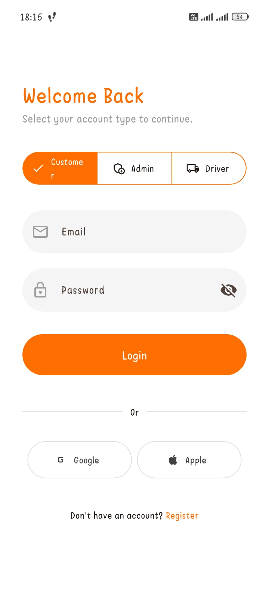
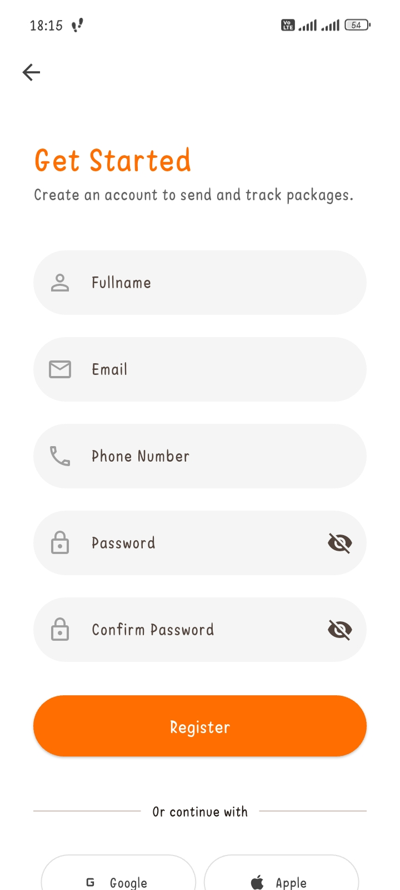
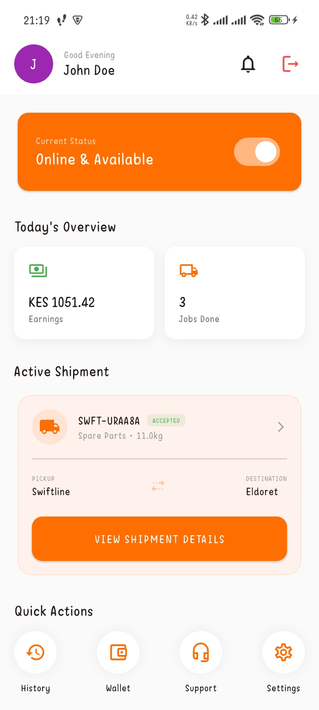
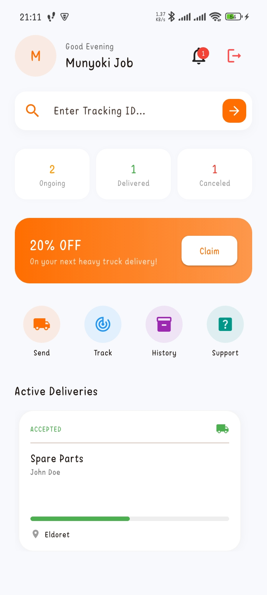

# Carrier

Carrier is a mobile application that allow a user to look for an available carrier vehicle at the moment based on their location for cargo transportation,
Users can track truck location and package status.

## Application Screens
### Login Page
User logs in based on role that is Customer, Driver or Station Admin, admin logs in using companies email, a driver account is created by Station Admin
in which email used will receive email with login credentials. For customer account if no account, click Register to create an account and login.

### Register Page
Create customer account for login.

### Station Admin Dashboard
From this page admin can be able to see total number of all drivers registered to the system, stations and all active bookings.
Admin can add stations, drivers, see all bookings and reports 

### Driver Dashboard
Drivers can set status if online or offline, view details of assigned packages, scan package or enter package code for pickup and vice versa after successful delivery.
See total money earned based on deliveries done.

### Customer Dashboard
Customer can book package delivery on active stations, track package, cancel delivery view package history and contact assigned drivers on package.

